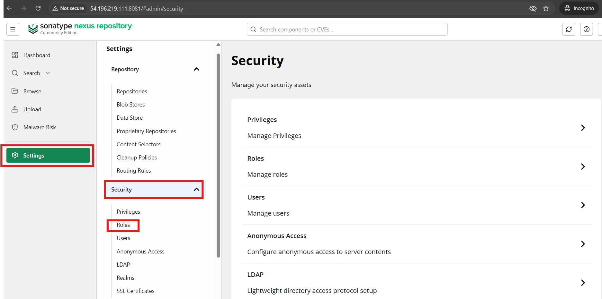

# Hands-on Lab: Integrate Sonatype Nexus with Jenkins for Artifact Management

This project implements an automated, secure CI/CD pipeline using Jenkins and Maven to build, verify, and deploy Java application artifacts into a Sonatype Nexus Repository.

`[GitHub Repo] ──(Webhook / Build)──> [Jenkins Pipeline] ──(Secure Build & Auth)──> [Nexus Repository]`

## Prerequisites

- Complete Jenkins CI Labs - part1, part2, and part3

## Step-01: Setting-up Sonatype Nexus Server (on Amazon Linux 2023)

### 1.1: Create an EC2 Instance

- Sign-in to AWS Account (https://console.aws.amazon.com/).
- Navigate to EC2 service >> **Launch Instance**.
- **Name**: nexus-server-local
- **AMI**: Amazon Linux 2023 6.1 Kernel
- **Instance Type**: t3.medium
- **Key Pair**: <create_new_keypair_or_select_existing>
- **VPC and Subnet**: Default
- **Public IP**: Enable
- **Security Group**:
  - **Name**: nexus-server-sg
  - **Ingress**: Allow 22 (SSH), 8081 (Nexus web UI)
- **Storage**: 15 GB, GP2 (min for this lab)
- Click on **Launch Instance** button

### 1.2: Download and Extract Nexus

- Install Java

```bash
# Update existing packages
sudo dnf update -y

# Install Java 21
sudo dnf install -y java-21-amazon-corretto-devel

# Verify the Java installation
java --version
```

- Download and Extract Nexus (https://help.sonatype.com/en/download.html)

```bash
cd /opt

sudo wget https://download.sonatype.com/nexus/3/nexus-3.93.0-06-linux-x86_64.tar.gz

sudo tar -xvf nexus-3.93.0-06-linux-x86_64.tar.gz

# Rename the extracted folder to a simplified name
sudo mv nexus-3.93.0-06 nexus
```

### 1.3: Create and configure a dedicated System user for Nexus

- For system security, running applications like _Nexus_ under root privileges is not advised.
- Runs the Nexus Java process on the server.
- Manages local directories like `/opt/nexus`.

- Create a dedicated service user for Nexus and assign ownership:

```bash
sudo adduser nexus
sudo chown -R nexus:nexus /opt/nexus
sudo chown -R nexus:nexus /opt/sonatype-work
```

> [!NOTE]
> The extraction automatically creates the data folder /opt/sonatype-work right alongside the application directory.

- Instruct Nexus to execute as your new user by uncommenting and editing the parameter inside `/opt/nexus/bin/nexus.rc`

```bash
sudo vi /opt/nexus/bin/nexus.rc

# Uncomment and edit the following parameter to read
run_as_user="nexus"
```

### 1.4: Configure Nexus as a Systemd Service

- Create a systemd startup script so you can manage the Nexus lifecycle:

```bash
sudo vi /etc/systemd/system/nexus.service

# Add the following contents to the unit file
[Unit]
Description=nexus service
After=network.target

[Service]
Type=forking
LimitNOFILE=65536
ExecStart=/opt/nexus/bin/nexus start
ExecStop=/opt/nexus/bin/nexus stop
User=nexus
Restart=on-abort

[Install]
WantedBy=multi-user.target
```

- Reload systemd configurations and trigger the background initialization:

```
sudo systemctl daemon-reload
sudo systemctl enable nexus
sudo systemctl restart nexus
```

## Step-02: Access the Nexus UI and Retrieve Admin Password

- The preceding commands will start the nexus service on port 8081.
- To access the nexus dashboard, visit:

```
http://nexus-server-public-ip-or-dns:8081
```

- You will be able to see the Nexus Dashboard login page. To sign-in, use the following credentials:
  - Username: `admin`
  - Password: `run-following-cmd-to-retrieve-temp-pwd`

    ```
    sudo cat /opt/sonatype-work/nexus3/admin.password
    ```

- Now, you should land on your personalize Nexus Dashboard page.

## Step-03: Create and configure a local Nexus User for Jenkins integration

### 3.1: Create a Role in Nexus

- This step defines what Jenkins is allowed to do in Nexus (add and edit artifacts in your Maven repositories).

- Sign-in through Nexus Dashboard as an admin &rarr; Settings &rarr; Security &rarr; **Roles**.
- Click Create role &rarr; select **Nexus role**.
- Fill out the following details:
  1. **Role ID**: `jenkins-deployer`
  2. **Name**: Jenkins Deployer Role
  3. **Description**: Allows Jenkins to upload Maven artifacts
     

- In the **Privileges section**, click on Modify Applied Privileges button &rarr; use the filter box to find and add following permissions:
  - nx-repository-view-maven2-\*-add (Allows uploading new artifacts)
  - nx-repository-view-maven2-\*-edit (Allows overwriting or updating snapshots)
  - nx-repository-view-maven2-\*-read (Allows Jenkins to view existing components)
  - nx-repository-view-maven2-\*-browse (Allows viewing files in the UI index)

- Click **Create role**

### 3.2: Create a local User Account in Nexus and assign Role

- This step creates the actual credentials that Jenkins will use to log in to Nexus.

- In the left sidebar, navigate to **Security** &rarr; **Users** &rarr; Click **Create local user** button.
- Fill out the user profile details:
  - ID: `jenkins-svc` (this will be the username in Jenkins)
  - First Name: Jenkins
  - Last Name: Service
  - Email: jenkins@yourcompany.com
  - Status: Set to Active
  - Password: Enter a strong, unique password
  - **Roles** section &rarr; find `Jenkins Deployer Role` under **Available roles** and move it to the **Granted** side.

- Click **Create local user**.

## Step-04: Save Nexus login Credentials to Jenkins

- Now that the account exists in Nexus, securely store it inside Jenkins so your pipelines can access it.

- Log into your Jenkins dashboard.
- Navigate to **Manage Jenkins** &rarr; Credentials &rarr; System &rarr; Global credentials (unrestricted).
- Click **Add Credentials**.
- Configure the fields exactly like this:
  - **Kind**: Username with password
  - **Scope**: Global
  - **Username**: `jenkins-svc` (The exact Nexus User ID you created)
  - **Password**: (The password you set for jenkins-svc)
  - **ID**: `nexus-deploy-creds` (Use this exact string in your pipeline script)
  - **Description**: Nexus deployment service account
- Click **Create**

## Step-05: Install required Jenkins Plugins

- **Pipeline Maven Integration** (for withMaven DSL)
- **Config File Provider** (for Maven setting.xml)

## Step-06: Create a Managed settings.xml

- Instead of keeping configuration files in your repository, store your repository configuration inside Jenkins.

- Go to Dashboard &rarr; Manage Jenkins &rarr; Managed files (requires the Config File Provider plugin).
- Click **Add a new Config** and select **Maven settings.xml**.
- ID: nexus-maven-settings
- In the XML content, configure the `<servers>` block. Ensure the <id> string matches what you will use in your pipeline:

```bash
<settings>
    <servers>
        <server>
            <id>nexus-releases</id>
            <username>${nexus.username}</username>
            <password>${nexus.password}</password>
        </server>
        <server>
            <id>nexus-snapshots</id>
            <username>${nexus.username}</username>
            <password>${nexus.password}</password>
        </server>
    </servers>
</settings>
```

## Step-07: Update the Jenkins Pipeline Script (Jenkinsfile) for uploading artifacts to Nexus

- This declarative pipeline uses java-21 to build a Maven application.

```groovy
pipeline {
    agent any

    parameters {
        string(
            name: 'NEXUS_IP',
            defaultValue: '52.91.97.106',
            description: 'The IP address or hostname of the Nexus server'
        )
    }

    tools {
        maven 'maven-3.9.16'
    }

    stages {
        stage('Build & Deploy to Nexus') {
            steps {
                // Link your Jenkins managed settings file here
                withMaven(mavenSettingsConfig: 'nexus-maven-settings') {

                    // Bind your Jenkins credentials to variables that Maven reads
                    withCredentials([usernamePassword(credentialsId: 'new-nexus-creds', passwordVariable: 'nexus.password',
usernameVariable: 'nexus.username')]) {

                        // Use your dynamic alternate repositories for deployment
                        sh """
                            mvn clean deploy \\
                            -DaltReleaseDeploymentRepository=nexus-releases::default::http://${params.NEXUS_IP}:8081/repository/maven-releases/ \\
                            -DaltSnapshotDeploymentRepository=nexus-snapshots::default::http://${params.NEXUS_IP}:8081/repository/maven-snapshots/
                        """
                    }
                }
            }
        }
    }
    post {
        success {
            echo 'CI Pipeline completed successfully! Code is compiled, tested, packaged and shipped to nexus.'
        }
        failure {
            echo 'CI Pipeline execution failed. Please check build console logs for more details.'
        }
    }
}
```

## Step-08: Push the changes to GitHub (SCM)

```
git add Jenkinsfile

git commit -m "Update Jenkinsfile for Nexus"

git push -u origin main
```

## Step-09: Create a Jenkins Job (pipeline)

- Open your Jenkins dashboard &rarr; **New Item**.
  - **Name**: `maven-nexus-pipeline`
  - **Job type**: Pipeline
  - **Definition**: Pipeline script from SCM
    - **SCM**: Git
    - **Repository URL**: Enter your GitHub repo link (e.g., https://github.com)
    - **Credentials**: If your repository is private, select your GitHub access credentials from the dropdown list.
    - **Branches to build**: main
    - **Script Path**: Verify this is set to Jenkinsfile
- Click **Save**

## Step-10: Verify the results | Pipeline | Artifacts on Nexus

- Select the above created Jenkins job and click **Build now** button to trigger it manually.

- Jenkins will first download your Jenkinsfile from GitHub, parse the execution steps, check out your complete project files into the workspace, and run the Maven build to deploy straight to Nexus.

- Verify the Jenkins Build status.
- Then, switch to the Nexus Dashboard and verify if the Nexus has received the build artifacts in maven-snapshots repository.

## Suggestions

### Define Nexus server details in your pom.xml

- Add a <distributionManagement> block inside your project's pom.xml file so Maven natively knows where to send the artifacts:

```xml
<distributionManagement>
    <repository>
        <id>nexus-releases</id>
        <url>http://<your-nexus-url>:8081/repository/maven-releases/</url>
    </repository>
    <snapshotRepository>
        <id>nexus-snapshots</id>
        <url>http://<your-nexus-url>:8081/repository/maven-snapshots/</url>
    </snapshotRepository>
</distributionManagement>
```

### Skip Test Compilation completely

- This completely prevents Maven from compiling or touching your test source directories:

```
mvn deploy -Dmaven.test.skip=true ...
```

- Deploy pre-compiled artifacts directly (Advanced)

```
mvn deploy:deploy-file \
  -Dfile=target/my-app-1.0.jar \
  -DgroupId=com.company \
  -DartifactId=my-app \
  -Dversion=1.0 \
  -Dpackaging=jar \
  -DrepositoryId=nexus-releases \
  -Durl=http://your-nexus-ip:8081/repository/maven-releases/
```
