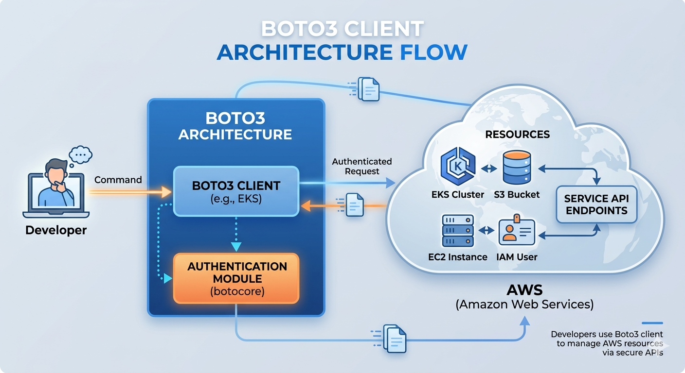

# AWS SDK for Python (boto3)

- The AWS SDK for Python, also known as Boto3, is the official library used to create, configure, and manage Amazon Web Services directly through Python code.

- It acts as an intermediary layer that translates native Python commands into API requests that AWS infrastructure can execute.

## Setup Boto3

### Install python and pip

- You can download and install python+pip from this link: https://www.python.org/downloads/

```bash
# To verify the python installation
python --version

# To verify the pip installation
pip --version
```

### Install Boto3

```bash
pip install boto3
```

### Download & Install AWS CLI

- For AWS CLI install or update, refer to this link: https://docs.aws.amazon.com/cli/latest/userguide/getting-started-install.html

### Generate AWS IAM User Access keys

- Sign into the AWS Management Console.
- Navigate to **IAM** service >> **Create new User with just programmatic access (CLI)** >> Assign **AdministratorAccess** Policy.
- Choose the name of the user whose access keys you want to manage, and then choose the **Security credentials** tab.
- In the **Access keys** section, say **Create access key**
- Choose **Download .csv file** with keys.

### Configure the AWS CLI

- After installing the AWS CLI, do the following steps to configure it.
- On command prompt/terminal, enter the following command:

```bash
aws configure

# Enter the requested details
AWS Access Key ID [None]: <iam_user_access_key>
AWS Secret Access Key [None]: <iam_user_secret_access_key>
Default region name [None]: us-east-1
Default output format [None]: json
```

## `Boto3` Documentation

- https://docs.aws.amazon.com/boto3/latest/

### Architecture



## Using Boto3

- To use Boto3, you must first import it and indicate which service or services you're going to use:

```bash
import boto3
```

### Low level clients

```bash
import boto3

# Create a low-level client with the service name
sqs = boto3.client('sqs')

# EC2 & VPC Client (VPC operations are part of the EC2 service)
ec2_client = boto3.client('ec2', region_name='us-east-1')

# ELB Client (Standard/Classic Load Balancer)
elb_client = boto3.client('elb', region_name='us-east-1')

# ELB v2 Client (Application & Network Load Balancers)
elbv2_client = boto3.client('elbv2', region_name='us-east-1')

# Amazon EKS client
eks_client = boto3.client('eks', region_name='us-west-2')
```

## Lab: Create first Python program with Boto3

- This script initializes an S3 client and prints the names of all buckets in your account.

- Launch a new Jupyter Notebook and write the following code in it:

```bash
import boto3

# Create an S3 client
s3 = boto3.client('s3')

# List all buckets in your account
response = s3.list_buckets()

# Print the name of each bucket
for bucket in response['Buckets']:
    print(f"Bucket Name: {bucket['Name']}")
```

## Lab: Automated Nightly Cost-Saver

- In a company environment, developers often forget to turn off their development servers at the end of the day, resulting in high AWS bills.

- The following script automates cost savings by:
  1. Finding all running EC2 instances tagged with Environment: Development.

  2. Stopping them safely.
  3. Sending a summary notification to an administrator via Amazon SNS (Simple Notification Service).

### The Code

```bash

import boto3
from botocore.exceptions import ClientError

# --- CONFIGURATION ---
TAG_KEY = 'Environment'
TAG_VALUE = 'Development'
SNS_TOPIC_ARN = 'arn:aws:sns:us-east-1:123456789012:CostAlerts'  # Replace with your actual SNS Topic ARN

def stop_development_servers():
    # Initialize AWS Clients
    ec2 = boto3.client('ec2')
    sns = boto3.client('sns')

    # 1. Filter for RUNNING instances with the specific tag
    filters = [
        {'Name': f'tag:{TAG_KEY}', 'Values': [TAG_VALUE]},
        {'Name': 'instance-state-name', 'Values': ['running']}
    ]

    try:
        print("Scanning for running development instances...")
        response = ec2.describe_instances(Filters=filters)

        # Extract Instance IDs
        instance_ids = [
            instance['InstanceId']
            for reservation in response['Reservations']
            for instance in reservation['Instances']
        ]

        # 2. If instances are found, stop them
        if instance_ids:
            print(f"Found {len(instance_ids)} instances running. Stopping them now...")
            ec2.start_instances(InstanceIds=instance_ids) # Using client to stop them
            ec2.stop_instances(InstanceIds=instance_ids)

            # Formulate notification message
            message = f"AWS Automation Alert:\n\nThe following development instances were automatically stopped to save costs:\n"
            message += "\n".join([f"- {i_id}" for i_id in instance_ids])
            subject = f"SUCCESS: {len(instance_ids)} Dev Instances Stopped"

        else:
            print("No running development instances found. Nothing to do.")
            message = "AWS Automation Alert:\n\nNightly scan complete. Zero running development instances were found."
            subject = "SKIPPED: Nightly Dev Instance Scan"

        # 3. Send the execution summary via SNS
        print("Sending status notification via SNS...")
        sns.publish(
            TopicArn=SNS_TOPIC_ARN,
            Message=message,
            Subject=subject
        )
        print("Automation run completed successfully.")

    except ClientError as e:
        error_message = f"Automation failed due to AWS Error: {e.response['Error']['Message']}"
        print(error_message)

        # Attempt to notify the admin about the failure
        try:
            sns.publish(TopicArn=SNS_TOPIC_ARN, Message=error_message, Subject="FAILED: Dev Instance Automation")
        except Exception:
            print("Could not send failure alert via SNS.")

if __name__ == "__main__":
    stop_development_servers()

```
