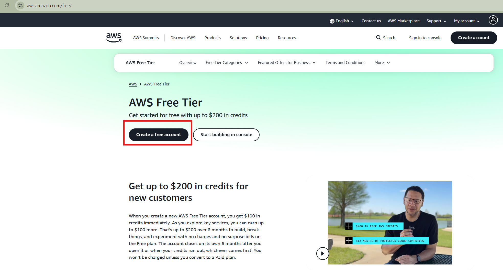
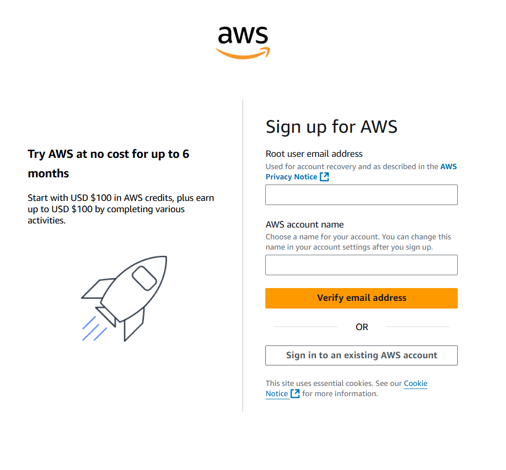
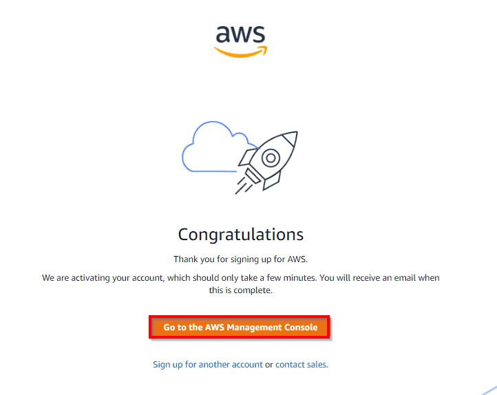

# Create an `AWS Account` (Free Tier)

- This article will help you understand how to create an AWS Free Tier Account.

- For more details, checkout the official documentation here: https://aws.amazon.com/free

## Prerequisites

- Valid Email Address
- Contact No. with SMS facility
- Credit Card

## Step-01: Navigate to AWS Account Creation page

- Launch your browser >> Navigate to >> Click on **Create a free account button** (as shown below)

- It will take you to the Sign-up Page.

## Step-02: Sign-up for AWS

- Enter a valid email address (which hasn't been registered yet with Amazon AWS) in the **Root user email address** field and **AWS Account Name** >> Click **Verify email address**

- Kindly verify the email that you must have received on the above entered Email address.

## Step-03: Provide Contact Information

- Once your email address is verified, you need to provide your contact information:
  - **AWS Account type (Profesional/ Personal)**: Personal Account
  - **Phone No**: <valid_phone_no>
  - **Country**: <country_name>
  - **Address**: <your_address_here>
  - Accept the Terms and condition and then click on **Create Account** and **Continue**

## Step-04: Provide Payment Information

- On this step, you must fill in your _credit card_ details and billing address.
- **Do you have a PAN?**: Yes
- Click on **Verify** and **Continue** button.
- It will take you to the bank's payment gateway page to verify the entered credit card information.
- Amazon will charge the minimum price based on the country you're located in. Here, I've considered country as India, so Amazon will charge you 2 INR.

## Step-05: Confirm your identity

- Select your preference for recieving the OTP out of following options:
  - Text message (SMS)
  - Voice call
- Enter the recieved code >> enter the captcha and move to next step.

## Step-06: Select the Support plan

- **Support plan**: Basic support - Free

## Step-07: Registration Confirmation

- Once you will complete all the above steps, you'll be navigated to the Congratulations page as shown below:

- Now, your account will be processed for activation which may take somewhere between 5 minutes to 1 hour.
- As soon as your AWS account is activated and ready for use, you will receive an email confirmation that your Amazon Cloud Services account has been activated successfully.

## Step-08: Access your AWS Account via AWS Management Console

- Navigate to AWS Management console: https://console.aws.amazon.com/
- User Type: Root user
- Username: <root_user_email_address>
- Password: <root_user_password>
