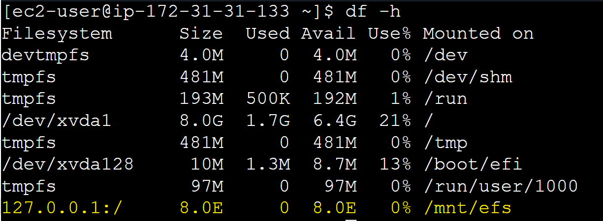

# Elastic File System (EFS)

## 01. EFS Overview

## 02. EFS Pricing

## 03. Lab: Create an EFS Volume and mount it on two EC2 Instance

### Prerequisites

- At least 1 EC2 Instances (preferably in diff AZs)
- A _Security group_ for all each EC2 instance that mounts the FS with a rule that allows:
  - Outbound access to the mount target on NFS port **2049**
  - Inbound: SSH (22)
- A _Security group_ for EFS mount target with a rule that allows:
  - Inbound access on NFS port **2049** from each EC2 instance on which you want to mount the file system

- The EC2 instance needs internet access or a VPC endpoint to install the _amazon-efs-utils_ package.

### Create an EFS Volume and Attach to EC2 Instance

- AWS Management Console >> EFS >> Create File System >> Click on Customize button
  - File System Settings
    - Name: lab-efs
    - File system type: Regional
    - Automatic backups: Disable
    - Leave rest of the settings to defaults
  - Network Access
    - VPC: same as ec2 instance
    - Mount targets: select the AZ in which your EC2 instances are running

### Install the `amazon-efs-utils` package

- Connect to your Amazon Linux instance over SSH.
- Once connected, run the following command to install the EFS client package from the Amazon Linux repositories

```
sudo dnf install -y amazon-efs-utils
```

### Create a local mount point directory and Mount the EFS file system

- Create a directory on your EC2 instance where the EFS file system will be mounted:

```
sudo mkdir -p /mnt/efs
```

- Mount the EFS file system on the directory created in the previous step:

```
sudo mount -t efs -o tls file-system-id:/ /mnt/efs

# Example
sudo mount -t efs -o tls fs-09deb72f82547e4cb:/ /mnt/efs

[Replace file-system-id with your actual EFS file system ID (e.g., fs-kdfkdef345356780gf]
```

- You can find the exact command from EFS service, by selecting your file system, and choosing the **Attach** option.

### Verify the EFS Volume Mount

- Check that the file system is successfully mounted by using the `df -h` command.

```
df -h

[You should see an entry for your EFS volume /mnt/efs mountpoint]
```

- When you run `df -h` on a client mounted with EFS, it often shows a massive total size of 8.0E (Exabytes) or other very high numbers.



- **Cause**
  - EFS is a serverless, elastic file system and does not have a fixed size to report.
  - The OS expects a traditional block device, fills in a default maximum value.

- **Solution**
  - This is an expected behavior.
  - Do not use `df -h` to check available EFS space.
  - Instead, check the Metered Size in the Amazon EFS console or via CloudWatch metrics (StorageBytes).
  - Or you can use AWS CLI commands to check the actual size of the EFS volume, as follows:
    ```
    aws efs describe-file-systems --file-system-id fs-09deb72f82547e4cb --region us-east-1 --query "FileSystems[0].SizeInBytes"
    ```
