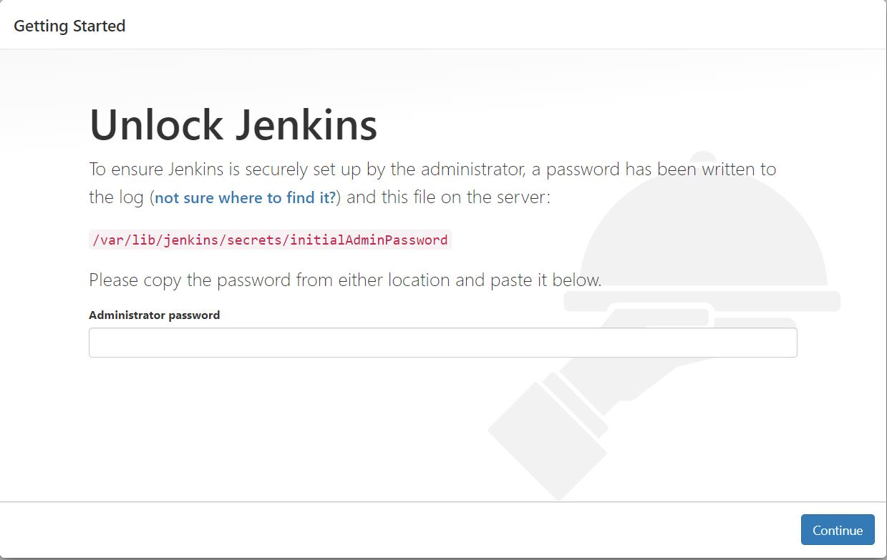
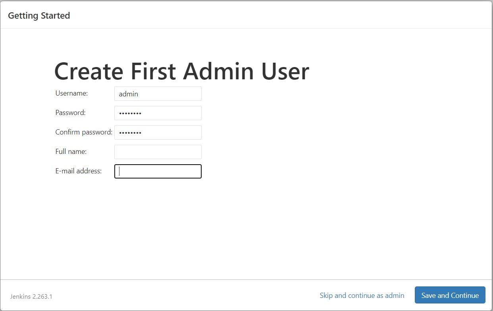

# Setting-up Jenkins Server

## Step-01: Setting-up Jenkins on Linux (Amazon Linux)

### Step-1.1: Create an EC2 Instance (VM)

- Sign-in to AWS Account (https://console.aws.amazon.com/).
- Navigate to EC2 service >> **Launch Instance**.
- **Name**: JENKINS-SERVER
- **AMI**: Amazon Linux 2023 6.1 Kernel
- **Instance Type**: t2.micro/t3.small
- **Key Pair**: <create_new_keypair>
- **VPC/Subnet**: Default
- **Elastic IP**: Enable
- **Security Group**:
  - **Name**: Jenkin-Server-SG
  - **Ingress**: Allow 22, 8080
- **Storage**: 15 GB, GP2/GP3 (min for this lab)
- Click on **Launch Instance** button

### Step-1.2: Install Java (prerequisite)

- Official link for java download: https://www.oracle.com/in/java/technologies/downloads/

```
# Update System Packages
sudo dnf update -y

# Install Java (JDK-17 or JDK-21)
sudo dnf install -y java-17-amazon-corretto.x86_64
OR
sudo dnf install -y java-21-amazon-corretto-devel

# To verify java installation
java --version
```

### Step-1.3: Install and Configure Jenkins

- Official website link for Jenkins download: https://www.jenkins.io/doc/book/installing/linux/

```
# Add Jenkins Repository
sudo wget -O /etc/yum.repos.d/jenkins.repo https://pkg.jenkins.io/redhat-stable/jenkins.repo

# Import Jenkins Key
sudo rpm --import https://pkg.jenkins.io/redhat-stable/jenkins.io-2023.key

# Install Jenkins
sudo dnf install jenkins -y

# Enable the Jenkins service
systemctl enable jenkins

# Start the Jenkins service
systemctl start jenkins

# To check Jenkins service status
systemctl status jenkins

# To check the current installed version of Jenkins
jenkins version
```

## Step-02: Update Jenkins Server's Security group rule to allow Jenkins traffic

_NOTE_: You can skip this step if you've already allowed ingress traffic on port 8080 in step-1.1.

- Navigate to your Jenkins server (EC2 Instance) settings from AWS management console >> select the **Security** tab
- Click on your security group name >> Select **Inbound Rules** >> **Edit Inbound Rules**
- Click **Add Rule** button
  - **Type**: Custom TCP
  - **Port range**: 8080
  - **Source**: Anywhere IPv4

## Step-03: Access Jenkins Server's Dashboard

- Open browser on your local system and navigate to **http://<your_jenkinsserver_public_ip>:8080**
- You will be able to access Jenkins Dashboard through its management interface:
  

## Step-04: Configuring Jenkins - Authenticate for first time use

### Step-4.1: Enter the Initial Admin Password

- As prompted, enter the password found in your Jenkins server's this file /var/lib/jenkins/secrets/initialAdminPassword

```
# Retrieve Initial Admin Password
sudo cat /var/lib/jenkins/secrets/initialAdminPassword

[Copy the password and paste it on the Unlock jenkins page password field]
```

- The Jenkins installation script directs you to the **Customize Jenkins** page.

### Step-4.2: Install suggested Jenkins plugins and Create an Admin user

- Click **Install suggested plugins**.
- Once the plugin installation is complete, the **Create First Admin User** will open.

### Step-4.3: Create an Admin user

- Enter requested Admin user details:
  - Name: jenkinsadmin
  - Password: <password>
  - Confirm Password: <password>
  - Username: jenkinsadmin
  - Email: <valid_email_address>
- Select **Save** and **Continue**.
- Now, you will land on Jenkins Dashboard after successfully log in as an Admin user.



## Step-05: Install `Git`

- _git_ will be required for fetching the code from SCM (GitHub) repo.

```
sudo dnf install -y git
```

## References

- [Jenkins Installation](https://www.jenkins.io/doc/pipeline/tour/getting-started/)
- [Installing Jenkins on various platforms](https://www.jenkins.io/doc/book/installing/)
- [Java Download](https://www.oracle.com/in/java/technologies/downloads/)
